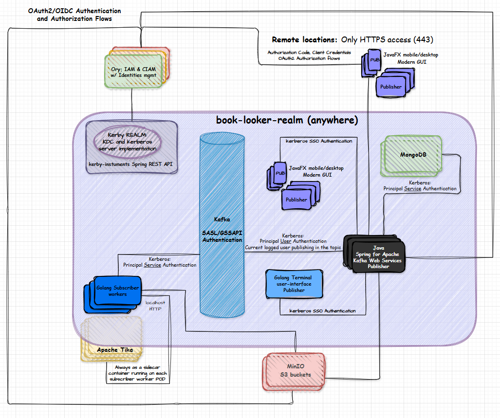

# Book looker Realm
Text and metadata (file contents and archive), detection and extraction pipeline, with catalog services, Go terminal-UI and JavaFX UI (mobile and desktop) in an own Kerberos realm.

### Overview

**Kafka:**
- Kafka V3.3.8 Broker with SASL/GSSAPI authentication. (v4.0.0 support not released yet in [Spring for Apache Kafka](https://spring.io/projects/spring-kafka#support))

**Java Spring for Apache Kafka REST Web Service:**
- Spring Data MongoDB for data persistence, management, and search.
- User authentication with Kerberos with SSO (Single Sign-On) support.
- Oauth2 authorization support.
- Docs/Archive uploader management service (abstracting all S3 details).
- Data encryption and decryption service with gnupg (key pairs isolated for each user principal).
- Catalog management and update catalog tasks.
- Metadata management, relationships, and analysis.
- Search capabilities (catalog and metadatas).
- Translations (languages) service.
- Information templates management.
- Kafka client: Publisher. Use the user principal of the current logged user for authentication to Broker.

**[JavaFX](https://openjfx.io/)** Mobile and Desktop Client UI:
- User authentication with Kerberos with SSO (Single Sign-On) support.
- Client (GUI FrontEnd) for the Spring for Apache Kafka REST Web Service.
- JavaFX app in internet only (80/443) locations:
    - Authorization Code Flow (with mTLS or PKCE depending the X.509 user cert local availability in the client)
    - Client Credentials flow if we consider a mobile/desktop-server authentication (and the client cert is always available localy in the client).

**Golang Terminal User-Interface:**
- User authentication with Kerberos with SSO (Single Sign-On) support.
- Can be used in files batch process, automate tasks, or other integrations.

**Golang Subscriber worker:**
- Service authentication with Kerberos service principal.
- Kafka client: Subscriber. Always connect and authenticate to the Broker using his service principal.
- MinIO S3 client.
- Tika (sidecar) Server client: Extract text and metadata from files and handle all other Tika features.

**Kerby:**
- Java Lib with the implementation of the Kerberos protocol and a complete KDC(AS/TGS) server.
- Only Kerberos, not other protocol or service.
- KDC with: in-memory, Mavibot(MVCC BTree) or JSON backends to store data (principals and keys).
- Preauth mechanism using JWT or PKI mechanism to request TGT and Service-Tickets.

**kerby-instruments**: https://github.com/mesb/kerby-instruments
- Java spring boot REST API for Apache Kerby, it never will be published in the internet.
- Remote Kerberos administration, management, instrumentation, metrics and telemetry.
- user principals gnupg vault: user principals key-pairs (gnupg) - Encryption for user data (users are able to decide if the private key will be stored here or not).
- realm vault: kerby-instruments svc key pairs (gnupg) / keyPurposeClientAuth/Client Authentication (user principals) x.509 certs (and private keys) only for 
Kerberos and OAuth2 Flows usage / KDC cert and key.
- Realm constrained delegation based in users signed JWTs
>**Self-signed private PKI embedded on Kerby-instruments:** 
- Needs supports to PKINIT EKUs keyPurposeKdc 1.3.6.1.5.2.3.5, keyPurposeClientAuth 1.3.6.1.5.2.3.4 and [some unusual fields for client certs and KDC cert](https://web.mit.edu/Kerberos/krb5-1.12/doc/admin/pkinit.html). Will be used to user authenticate with X.509 certificates (no need of keytabs or passwords inputs)
- Needs support to EKU Client Authentication 1.3.6.1.5.5.7.3.2. Clients will be able to create signed JTWs that can be validated in Ory Hydra
- Ory ecosystem needs to be configured to trust the self-signed PKI.

**Ory ecosystem:**
>
**Ory Hydra**: Golang OAuth2 and OpenID Connect provider for token-based authentication.
- kerby-instruments: Client Credentials.
- internet-only clients: Authorization Code Flow (with mTLS or PKCE depending the X.509 user cert local availability in the client). Maybe a Client Credentials flow if we consider a mobile/desktop-server authentication (and the client cert is always available localy in the client).
- OAuth2/OpenID Flows (MinIO and Spring for Apache Kafka REST Web Service).
>
**Ory Oathkeeper**: Golang Identity & Access Proxy / API (IAP) and Access Control Decision API.
- kerby-instruments: Client Credentials Flow. JWT mutations (defining correct identity claims).
>
**Ory Kratos**: Golang Identity and User Management system with self-service flows.
- Principals and keys (users and services) management in the Kerby realm.
>
**Ory Keto**: Golang Fine-grained authorization server with relationship-based access control.
- Fine-grained authorization for the Spring for Apache Kafka REST Web Service.
- Fine-grained authorization for the S3 buckets (MinIO).

### Kerberos delegation

The RFC 4120: [The Kerberos Network Authentication Service (V5)](https://datatracker.ietf.org/doc/html/rfc4120), in the sections 2.5 to 2.8, defines the delegation aspects of kerberos: *When a backend service is doing authentication (in a second backend service) on behalf of the user connected in the frontend.*

The bellow Ticket tags can control the delegation on kerberos realm and are only interpreted by the ticket-granting-service and authentication-service (TGS and AS are part of KDC). 

- "**PROXIABLE**" and "**PROXY**" tags are used to control the requests of the service-tickets (only), from service principals on-behalf authenticated users principals. This tag can be defined by the user principal in the initial authentication (or any time when getting the TGT or service-tickets).
- "**FORWARDABLE**" flag control the requests of TGT (ticket-grant-tickets) from service principals on-behalf authenticated users principals. This tag can be defined by the user principal in the initial authentication (or any time when getting the TGT or service-tickets).
- "**OK-AS-DELEGATE**" tag is defined when a service principal is getting his TGT (from AS). Will help the realm policy delegation decisions.

Expected behavior using *FORWARDABLE* ticket tag:

*image source: https://learn.microsoft.com/en-us/openspecs/windows_protocols/ms-sfu/1fb9caca-449f-4183-8f7a-1a5fc7e7290a*

Microsoft extended the Kerberos delegation capabilities with a [Constrained Delegation Protocol](https://learn.microsoft.com/en-us/windows-server/security/kerberos/kerberos-constrained-delegation-overview) known as [Service for User (S4U)](https://learn.microsoft.com/en-us/openspecs/windows_protocols/ms-sfu/3bff5864-8135-400e-bdd9-33b552051d94)

The book-looker-realm will face the Kerberos delegation as follow:

- **Non-Java servers (service principals)**: Default Kerberos V5 behavior via delegation ticket tags (and expect that kerby KDC can handle properly).

- **Java servers (service principals)**: kerby-instruments *kerby realm alternative constrained delegation*, using user-principals signed JWTs.

### kerby realm alternative constrained delegation:

The kerby-instruments HTTPS (Kerberos authenticated) endpoints for delegation services, needs to be used for service principals (servers) needing to authenticate on-behalf of users.

The kerby-instruments will generate and validate the user-principal JWT via Client Credentials flow and will use a changed JWT with the correct claims. After all policy validations, the delegation can be processed (if the case) and the JWT will be sended as a cryptographic text material to the service principal. The service principal will use the KrbClient (Apache Kerby lib) and request (on-behalf a user via decrypted JWT) a service-ticket for the other service-principal.

Here we achieved a constrained delegation in a *"FORWARDABLE level"* without using the kerberos protocol or data structures from Kerberos tickets.
The kerby-instruments (a KDC extension service) can act on-behalf of the user without user interaction and can apply policies on delegation requests, but in a *"FORWARDABLE level"*. When the service principal get the user principal JWT, it can be used to request a TGT and service-tickets (for any another service-principal) on-behalf of the user.

### Positive points about Kerberos

- **Service Session key** - Each client/server connection has its own session key, providing per-connection security (each Kerberos client connected to a MariaDB has its own session key, for example).
- **Mutual Authentication** - Both client and server verify each other's identity.
- **KDC Centralization** - In a Kerberos service/protocol/realm, only KDC servers have TCP/UDP listening ports (for Kerberos). When the client from a file-server or DB "kerberized" has aquired a service-ticket from a KDC using his valid TGT (to access the file-server or DB), the service-ticket is used in the authentication process\step from a given service\protocol (file-share or DB connection, for example).
- **Cross-Platform Support** - Widely supported across various operating systems and applications.
- **Strong Security** - Encrypted tickets and time-limited credentials.
- **Single Sign-On** - Principals authenticate once and gain access to multiple services without re-entering credentials.
- **Delegation Support** - Kerberos allows use cases for delegation of credentials, enabling services to act (getting service-tickets) on behalf of users. Improving tracking and auditing of user actions.

### Prerequisites
- Podman.
[Podman-kube](https://docs.podman.io/en/v5.0.3/markdown/podman-kube.1.html) is a prerequisite for create PODs based on Kubernetes.
This project uses sidecar containers and with Podman-kube the development environment is more similar to production.
- Go, Python and Java
- ...

## Tika Server
[**Documentation**](https://cwiki.apache.org/confluence/display/TIKA/TikaServer)

- **Extract Text from file (Tika detects the file type, including images using OCR)**: `POST http://localhost:9998/tika/form`
  - Content-Type: `multipart/form-data`
  - Accept: `text/plain`

- **Get Metadata (file and contents) from file**: `POST http://localhost:9998/meta/form`
  - Content-Type: `multipart/form-data`
  - Accept: `application/json`, `application/rdf+xml`, `text/csv`, `text/plain`

*Sample PDF files licensed under*: [**Creative Commons Attribution Share-alike 4.0**](https://creativecommons.org/licenses/by-sa/4.0/deed.en)