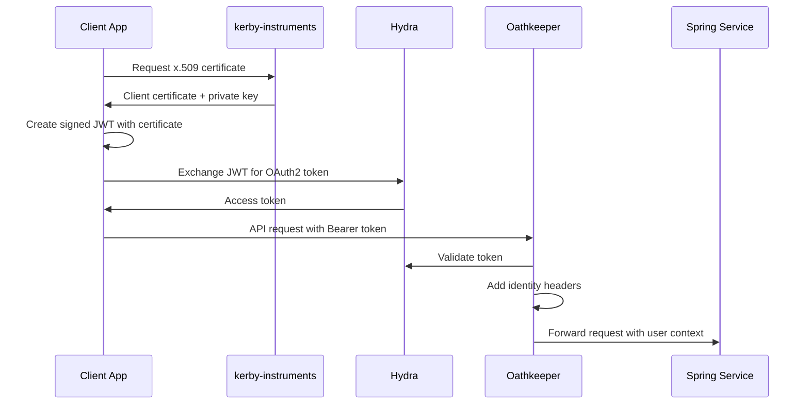

# Ory Ecosystem for book-looker-realm

This directory contains the complete Ory ecosystem deployment for the book-looker-realm project, providing comprehensive Identity and Access Management (IAM) with Kerberos integration.

## What's Included

### 🔐 Services

- **Ory Hydra** (OAuth2/OIDC Provider) - Token-based authentication with client certificate support
- **Ory Kratos** (Identity Management) - User registration, login, and Kerberos principal mapping  
- **Ory Keto** (Authorization Engine) - Fine-grained permissions using relationship-based access control
- **Ory Oathkeeper** (API Gateway) - Identity proxy with JWT validation and request mutation
- **PostgreSQL** - Persistent storage for all Ory services
- **MailSlurper** - Email testing for development
- **Jaeger** - Distributed tracing for debugging

### 📁 Structure

```
ory-ecosystem/
├── docker-compose.yml              # Main service orchestration
├── setup.sh                       # Automated setup script
├── INTEGRATION.md                  # Detailed integration guide
├── config/
│   ├── hydra/
│   │   └── hydra.yml              # OAuth2 provider configuration
│   ├── kratos/
│   │   ├── kratos.yml             # Identity management configuration
│   │   └── identity.schema.json   # User identity schema with Kerberos fields
│   ├── keto/
│   │   ├── keto.yml               # Authorization engine configuration
│   │   └── permissions.opl        # Permission model definition
│   └── oathkeeper/
│       ├── oathkeeper.yml         # API gateway configuration
│       └── access-rules.yml       # Request routing and authorization rules
└── certs/                         # Development certificates (auto-generated)
```

## 🚀 Quick Start

1. **Setup and start everything:**
   ```bash
   ./setup.sh
   ```

2. **Or step by step:**
   ```bash
   # Start services
   docker-compose up -d
   
   # Wait for services to be ready
   sleep 30
   
   # Create OAuth2 clients and permissions
   # (this is done automatically by setup.sh)
   ```

## 🔗 Service Endpoints

| Service | Public | Admin | Description |
|---------|--------|-------|-------------|
| **Hydra** | `:4444` | `:4445` | OAuth2/OIDC tokens |
| **Kratos** | `:4433` | `:4434` | Identity management |
| **Keto** | `:4466` (read) | `:4467` (write) | Permissions |
| **Oathkeeper** | `:4455` | `:4456` | API Gateway |
| **MailSlurper** | `:4436` | - | Email testing |
| **Jaeger** | `:16686` | - | Tracing UI |

## 🔧 Integration with book-looker-realm

### Authentication Flow



### Key Integration Points

1. **JWT Creation** - Clients use x.509 certificates from kerby-instruments to create signed JWTs
2. **Token Exchange** - JWTs are exchanged for OAuth2 tokens at Hydra
3. **API Gateway** - Oathkeeper validates tokens and adds identity headers
4. **Authorization** - Keto provides fine-grained permissions for resources

## 🛡️ Security Features

- **mTLS Support** - Client certificate authentication
- **JWT Validation** - Signed token verification with your PKI
- **Fine-grained Authorization** - Resource-level permissions
- **Identity Proxy** - Centralized authentication/authorization
- **Audit Trail** - Request tracing and logging

## 📊 Monitoring

### Health Checks
```bash
# Check all services
make ory-status

# Individual service health
curl http://localhost:4444/health/ready  # Hydra
curl http://localhost:4433/health/ready  # Kratos  
curl http://localhost:4466/health/ready  # Keto
curl http://localhost:4455/health/ready  # Oathkeeper
```

### Debugging
- **Tracing:** http://localhost:16686 (Jaeger)
- **Emails:** http://localhost:4436 (MailSlurper)
- **Admin APIs:** See service endpoints table above

## 🔄 OAuth2 Clients

The setup script automatically creates these OAuth2 clients:

| Client ID | Grant Type | Scope | Usage |
|-----------|------------|-------|-------|
| `kerby-instruments` | Client Credentials | `realm.admin` | Kerberos realm management |
| `spring-service` | Authorization Code | `api.access` | REST service authentication |
| `javafx-desktop` | Authorization Code + PKCE | `api.access` | Desktop client |
| `go-tui` | Client Credentials | `batch.process` | CLI automation |

## 📋 Permission Model

The Keto permission model includes:

- **Documents** - PDF files and metadata
- **Catalogs** - Document catalogs and search
- **S3 Buckets** - MinIO storage access  
- **Kafka Topics** - Message processing
- **Kerberos Principals** - Identity management

See `config/keto/permissions.opl` for the complete model.

## 🔧 Configuration

All services are configured to:
- Trust your self-signed PKI from kerby-instruments
- Support Kerberos principal mapping
- Provide JWT-based authentication
- Enable fine-grained authorization
- Support constrained delegation

## 📚 Next Steps

1. **Deploy kerby-instruments** - Set up the Kerberos realm server
2. **Configure Spring Boot** - Update your REST service to use Oathkeeper
3. **Implement Clients** - Add OAuth2 flows to JavaFX and Go applications
4. **Production Setup** - Replace development certificates and secrets

For detailed integration instructions, see [INTEGRATION.md](./INTEGRATION.md).

## 🐛 Troubleshooting

### Common Issues

1. **Services not starting:** Check `docker-compose logs [service]`
2. **Certificate errors:** Ensure PKI is properly configured in Hydra/Oathkeeper
3. **Permission denied:** Verify Keto relationships are set up correctly
4. **Token validation failed:** Check JWT signing and Hydra configuration

### Getting Help

- Check the logs: `docker-compose logs -f`
- Review service health: `make ory-status`  
- Consult [INTEGRATION.md](./INTEGRATION.md) for detailed examples
